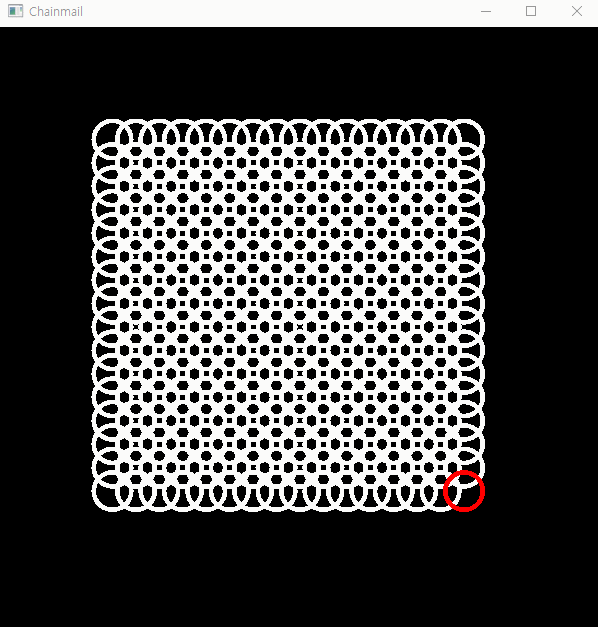

# Chainmail_Timestamp

체인메일 알고리즘을 timestamp를 이용하여 구현

구현 현황 : Propagation O, Relaxation O (모두 Homogeneous한 경우)

실행 결과

1. Propagation

2. Relaxation

   1.  Spring model
      

      

   2.  Sein's model
      